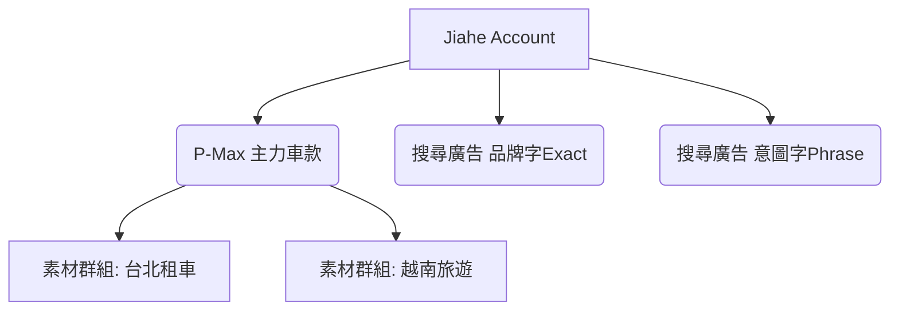

# 💰 PPC 廣告活動架構重建方案 — Test
為「Test」設計的全新 PPC 帳戶架構。

## 1. 帳戶架構調整 (Mermaid)

```mermaid
graph TD
    A[Jiahe Account] --> B(P-Max 主力車款)
    A --> C(搜尋廣告 品牌字Exact)
    A --> C2(搜尋廣告 意圖字Phrase)
    B --> D[素材群組: 台北租車]
    B --> E[素材群組: 越南旅遊]
```

## 2. 預算與出價策略
- **搜尋廣告 (品牌字)**: 採用「盡可能爭取點擊」，確保 100% 曝光佔有率。
- **P-Max 廣告 (轉換字)**: 預算佔 60%，出價策略設定為 Target ROAS 250%。
